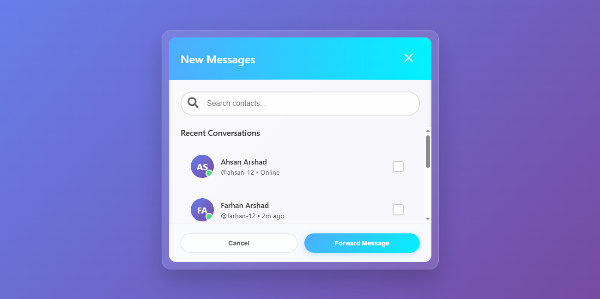
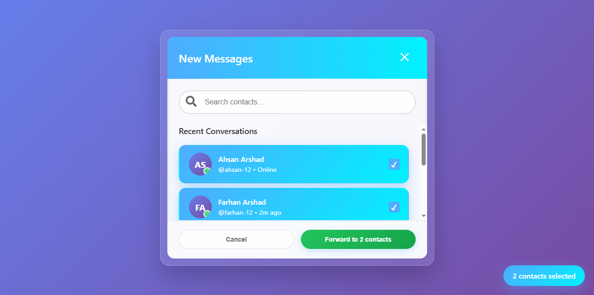

# 💬 Messaging Forward Dialog Box

This project showcases a **messaging forward dialog box** interface where users can search, select, and forward messages to their desired contacts. It replicates the smooth, modern messaging experience found in chat applications — designed with a clean UI and responsive behavior using **HTML, CSS, and JavaScript**.

---

## 🌐 Live Demo

🚀 **View Project on Vercel:** [Messaging Forward Dialog Box](https://messaging-dialog-animation.vercel.app/)

---

## 🚀 Features

- 📩 **Message Forwarding** — Allows the user to select one or multiple contacts and forward a message.  
- 🔍 **Search Contacts** — Search bar to filter contacts dynamically.  
- 👥 **Recent Conversations** — Displays a list of recent chats with user status (e.g., Online, Last seen).  
- ✅ **Selection Indicator** — Highlights selected users visually with a checkbox and color accent.  
- 💬 **Success Popup** — Shows an alert confirming successful message forwarding (e.g., “Message forwarded successfully to: Ahsan Arshad”).  
- 🧭 **Smooth UI Flow** — Modal-based popup for seamless in-app message actions.  
- 🎨 **Modern Design** — Gradient background, soft shadows, rounded corners, and intuitive color contrast.  

---

## 🛠️ Technologies Used

- **HTML5** – for structure and layout  
- **CSS3** – for visual styling and gradients  
- **JavaScript (Vanilla JS)** – for interactivity and DOM manipulation
  
---

## ⚙️ How It Works

1. Open the `index.html` file in your browser.
2. The "New Messages" modal appears with a list of contacts.
3. Select one or more contacts.
4. Click **“Forward to X contact(s)”**.
5. A success alert confirms the message forwarding.

---

## 🧠 Learning Highlights

- Implementing dynamic UI behavior with pure JavaScript.  
- Creating responsive, user-friendly modals using CSS.  
- Managing selection states and user feedback (via alerts).  

---

## 🪄 Future Improvements

- Replace browser alert with custom modal or toast notification.  
- Enable multi-contact forwarding with batch message preview.  
- Add animations for modal transitions.  
- Store contact list and message data dynamically (e.g., JSON or localStorage).  

---

## 📸 Preview

### 💬 Message Forward Dialog

### ✅ Message Forward Confirmation

---

## 👨‍💻 Author

**Muneeb Nadeem**  
Frontend Web Developer (React.js | Next.js | JavaScript)  
📍 [GitHub Profile](https://github.com/Muneeb2721/messaging-dialog-animation)

---

## 🧾 License

This project is open-source and available under the **MIT License**.
